# Drippin 전체 화면 플로우 (스크린샷)

> 접근 가능한 모든 화면을 **플로우 단위**로 캡처한 모음. 추후 로드맵 논의(기능 + 비주얼)의 기준 자료.
>
> - 캡처일: **2026-05-21** · 뷰포트: **390×844(모바일)** · 로그인 상태(`@Drippin`)
> - 파일명 규칙: `NN_<flow>_SS_<name>.png` — `NN`=플로우 순서, `SS`=플로우 내 단계. 파일명 정렬 = 플로우·단계 순서.
> - 피드/목록은 첫 화면(viewport), 상세/폼은 전체(full page) 캡처.

---

## 전체 흐름 한눈에

```
                          ┌─────────────────────────────┐
                          │  01 홈 피드 (레시피 ⇄ 일지 탭)  │
                          └──────────┬─────────┬────────┘
            ┌────────────────────────┘         └───────────────────────┐
            ▼                                                            ▼
┌────────────────────────────┐                          ┌────────────────────────────┐
│ 02 레시피 재생 플로우          │                          │ 05 일지 플로우                │
│ 목록 → 상세 → 온보딩 → 타이머  │                          │ 목록 → 상세                  │
└──────┬───────────────┬─────┘                          └──────┬───────────────┬─────┘
       │ (작성 FAB)      │ (소유자)                          │ (작성 FAB)       │ (소유자)
       ▼               ▼                                    ▼                ▼
┌──────────────┐  ┌──────────────┐                  ┌──────────────┐  ┌──────────────┐
│ 03 레시피 생성 │  │ 04 레시피 편집 │                  │ 06 일지 작성   │  │ 07 일지 편집   │
│  4단계 위저드  │  └──────────────┘                  └──────────────┘  └──────────────┘
└──────────────┘

  하단 탭/카드에서 진입 →  ┌──────────────────────────┐   ┌───────────────────────┐
                         │ 08 커뮤니티 (프로필 · 태그) │   │ 09 내정보 (+ 기록 요약) │
                         └──────────────────────────┘   └───────────────────────┘
```

- **연결점**: 일지 상세의 `@handle`/`#태그` → 08 커뮤니티. 일지 상세의 "사용 레시피"(연결 강화 예정 🔴) → 02 레시피. 내정보의 "내 프로필 보기" → 08 프로필.

---

## 01 · 홈 피드 (`/`)

서비스 첫 진입. 상단 레시피/일지 탭 전환(`?tab=`), 무한스크롤.

| 레시피 탭 | 일지 탭 |
|---|---|
| 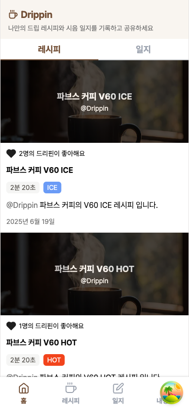 | 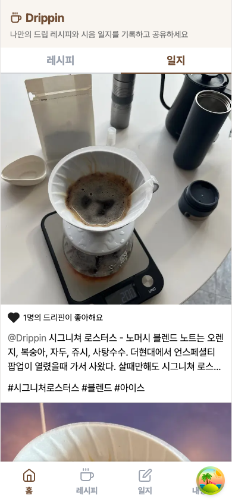 |

## 02 · 레시피 재생 플로우 (`/recipe` → 상세 → 온보딩 → 타이머)

코어 시나리오 A. 발견 → 파라미터 확인 → 단계별 타이머로 추출 재연.

| 1. 목록 (`/recipe`) | 2. 상세 (`/recipe/[id]`) |
|---|---|
| 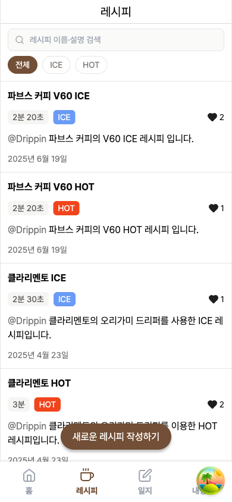 | 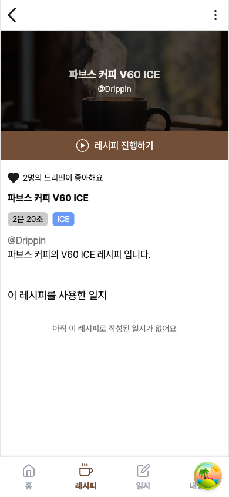 |

| 3. 온보딩 (`/recipe/[id]/onboarding`) | 4. 타이머 (`/recipe/[id]/timer`) |
|---|---|
| 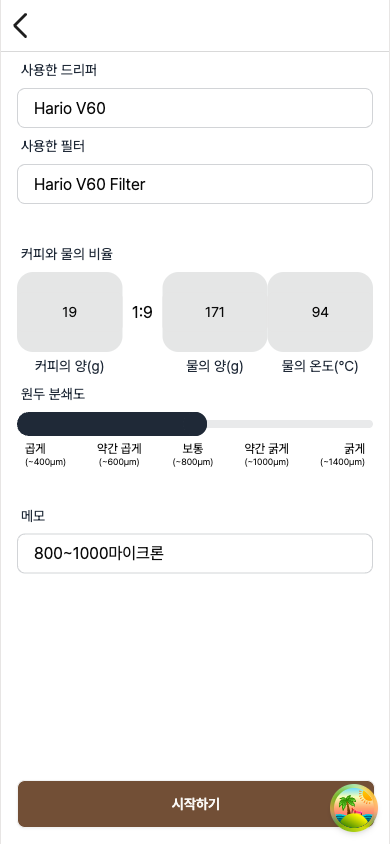 | 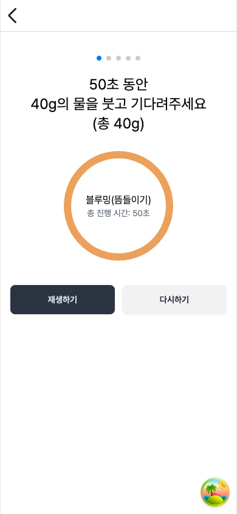 |

## 03 · 레시피 생성 (`/recipe/add`, 4단계 위저드)

코어 시나리오 C. 로그인 필요. (※ 캡처용으로 단계만 진행, 게시하지 않음)

| 1. 기본 정보 | 2. 물과 원두 |
|---|---|
| 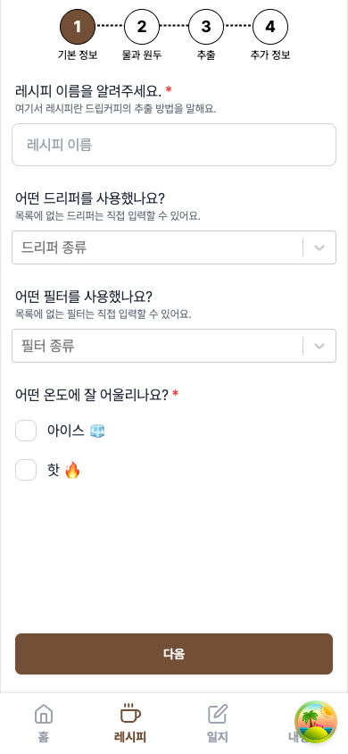 | 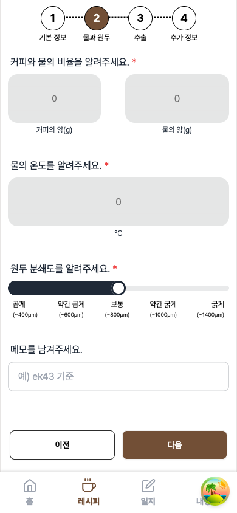 |

| 3. 추출(푸어 단계) | 4. 추가 정보(설명·사진·게시) |
|---|---|
| 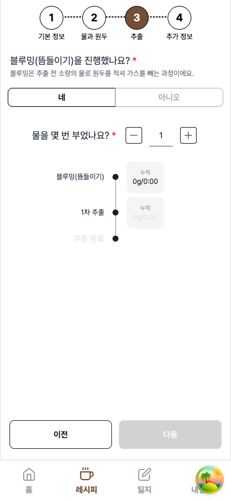 | 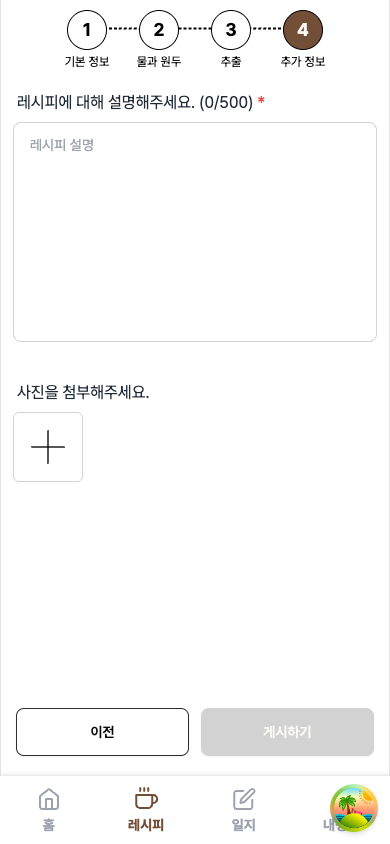 |

## 04 · 레시피 편집 (`/recipe/[id]/edit`)

소유자만. 생성 위저드와 동일 폼을 펼친 형태.

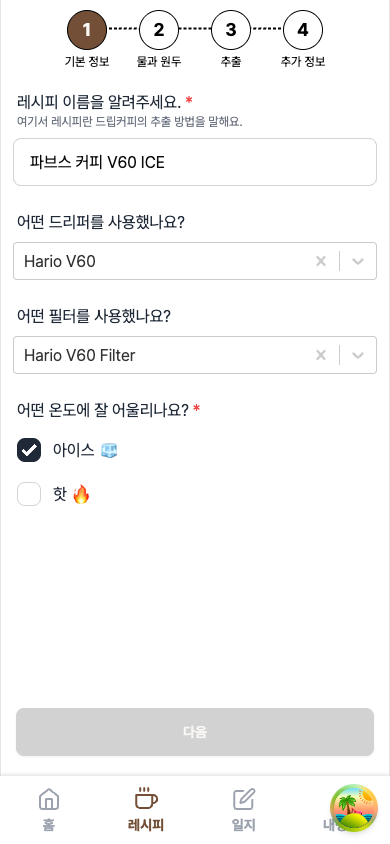

## 05 · 일지 플로우 (`/log` → 상세)

코어 시나리오 B의 결과물. 인스타 풍 가벼운 기록.

| 1. 목록 (`/log`) | 2. 상세 (`/log/[id]`) |
|---|---|
| 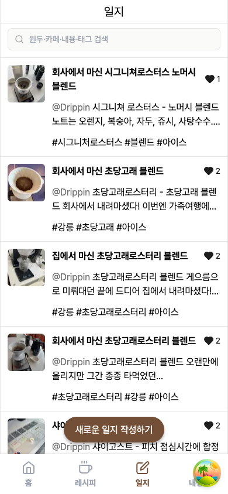 | 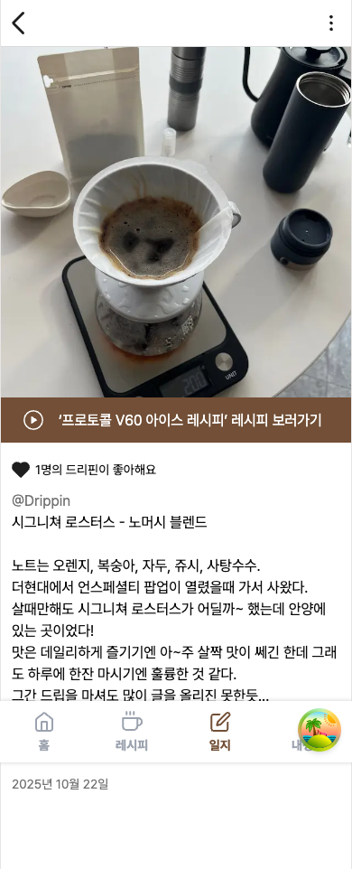 |

## 06 · 일지 작성 (`/log/add`)

로그인 필요. 내용 + 사진.

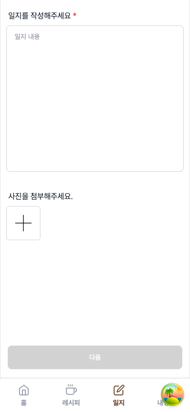

## 07 · 일지 편집 (`/log/[id]/edit`)

소유자만.

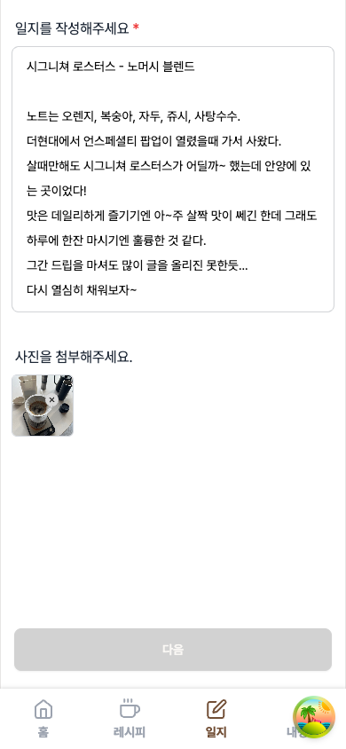

## 08 · 커뮤니티 (프로필 · 태그)

코어↔커뮤니티 다리. 상단 인라인 앱바(뒤로가기 + 아이콘 + `@handle`/`#tag`).

| 프로필 홈 (`/profile/[handle]`) | 태그 페이지 (`/tag/[tag]`) |
|---|---|
| 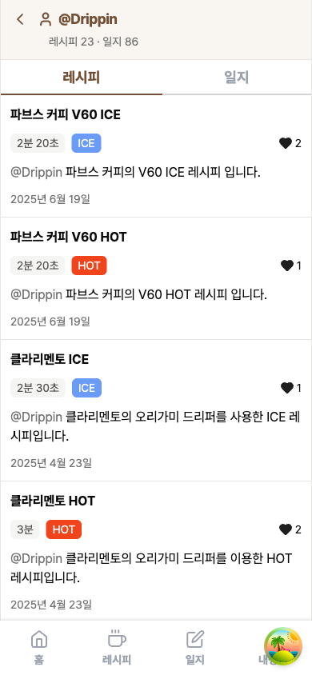 | 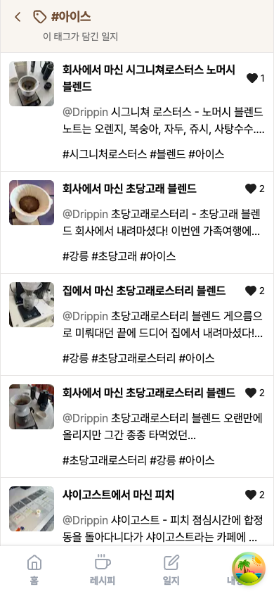 |

## 09 · 내정보 (`/my`)

이름·이메일·닉네임 + **내 기록 요약**(이번 달 잔 수·누적·자주 마신 곳·6개월 추이) + 로그아웃.

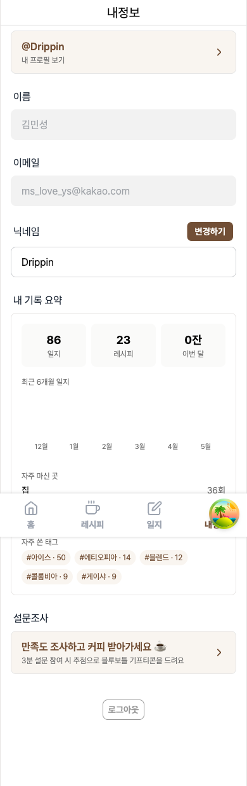

---

## 아직 안 담긴 상태 (필요 시 추가 캡처)

- **비로그인 LoginNudge** — `/my`·`/recipe/add`·`/log/add`에 비로그인 진입 시 노출(로그아웃 필요로 이번엔 제외).
- **타이머 재생 중** 상태(카운트다운 진행) — 현재는 진입 직후 정지 화면.
- **검색 결과 / 빈 상태** — 목록 검색어 입력 후, 데이터 없는 사용자의 빈 화면.
- **768px(태블릿) 레이아웃** — 현재는 390px 모바일만.
- **다크 모드** — 현재는 라이트 모드만.
